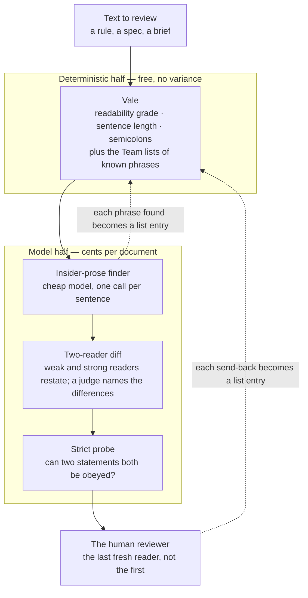

# Claudian Translator

Claudian Translator is a review lane for text written with an AI inside a long conversation. It finds the sentences that only make sense to the people who were in that conversation, and it shows what the same sentence looks like written for the people who were not.

## The problem

Standards, specs, onboarding pages and agent briefs drafted with an AI come out fluent and wrong for their reader. The drafting conversation coins a phrase, leans on a metaphor, or folds an argument into a rule, and the text carries that habit out into a document a stranger has to follow. A human reviewer returns it as unreadable, the author cannot see why, and the next draft repeats the pattern. In one week, two engineering standards drafted this way were returned five times in 48 hours. The meaning was intact every time. The reader could not get to it.

## What this does

It reads a document and flags the sentences below, by shape. Every "before" was sent back by a human reviewer or flagged by the lane. Every "after" is the text that replaced it.

| shape | before | after |
|---|---|---|
| metaphor as definition | A copy you did not write is still only evidence of its moment — re-derive before relying. | A copied fact in a document you did not write was true when it was copied, not necessarily now. Check the source before you act on it. |
| metaphor | Code-shaped architecture is invisible and therefore drifts. | Code a reviewer cannot see from outside the repository drifts. Publish a rendering. |
| metaphor | The census is a burn-down, not an amnesty. | A census is a list of debts to pay down, not a pardon. |
| metaphor as instruction | A reason that keeps recurring is a backlog item wearing a footnote's clothes. | File a recurring reason as the backlog item it is. |
| slogan | Render from data. | Every state machine has a rendering derived from its definition that a reviewer can reach without reading code. |
| coined noun | The forcing function is the machine census. | The census is what finds a state written outside the machine. |
| reason inside the rule | The chain counts as a site because it is the tell — the defect this rule exists to find. | The chain is counted as evidence of the defect, not as permission for it. |
| ordinary words, insider meaning | A hand-copy is a signal — a derivation path is missing. | A hand-copy means a derivation path is missing. |
| an abstraction in a person's role | Standards written inside a long AI-assisted conversation come out readable only to that conversation. | Standards written inside a long AI-assisted conversation come out readable only to the people who were in that conversation. |
| welded obligations, 57 words | If an attribute's legal next value depends on its current value and it meets the threshold below, it is a state machine: it belongs to a named machine definition …, and a nested or parallel lifecycle is expressed in the definition, never as a loop or branch in an executor. | An attribute is a state machine when its legal next value depends on its current value and it meets the threshold below. Nothing else is required. Where a lifecycle nests or runs in parallel, it is expressed in the definition, never as a loop or branch in an executor. |
| closed list | The schema column with its constraints is one site. Each executor's switch or branch chain is another. | … Each executor's switch or branch chain is another, among others. |
| read as a contradiction | …a design change, announced at review — never folded into a refactor. | …a design change, even when it arrives inside a refactor. It is announced at review, never made quietly. |
| bullets rendered horizontally | Two lanes and one loop. The linter counts and remembers. The models read and discover. The reviewer decides. | The linter counts sentence length, readability grade and semicolons, and it matches every phrase it has been taught. The models read for meaning and discover the phrases the linter has not been taught yet. The human reviewer makes the final call. |

The lane never blocks a document. Each flag is a note. The author rewrites the sentence or defends it on the record, and either answer closes the flag.

## How to install

You need three things.

1. **Vale** 3 or later, the open-source prose linter: `brew install vale`, `winget install errata-ai.Vale`, or a binary from `github.com/errata-ai/vale/releases`.
2. **A model CLI with two tiers**, a cheap one and a strong one. The tools call the Claude Code CLI in print mode (`claude -p`) with an empty `--setting-sources` so the reader holds only the text. Any equivalent works if you change one `spawn` line.
3. **Node** 18 or later.

Then:

```sh
git clone <this repo> claudian-translator
cd claudian-translator
cd vale && vale sync && cd ..      # downloads the public packs once
```

`vale sync` reads `vale/.vale.ini` and fetches the Microsoft, write-good, proselint and Readability packs into `vale/styles/`. The `Team` and `Slopster` styles are in the repo already.

## How to use

Run the checks in this order. Each one prints flags. Nothing exits non-zero except the diff, which exits 1 when the two readers disagree.

```sh
# 1. Deterministic: form and every known phrase. Free, milliseconds.
vale --config vale/.vale.ini --output=line doc.md

# 2. The insider-prose finder: one cheap call per sentence, eight in flight.
node tools/claudian.mjs doc.md --model haiku --jobs 8

# 3. The two-reader diff: a weak and a strong reader restate the text; the strong one names where their meanings differ.
node tools/plain-reader.mjs doc.md --diff

# 4. The strict probe: can any two statements not both be obeyed? Answers NONE on a clean text.
node tools/plain-reader.mjs doc.md --probe

# Fallback with no Vale installed: the counters alone.
node tools/hygiene-sweep.mjs doc.md
```

Treat every line of output as a flag. Rewrite the sentence or write one line saying why it stands. When a model or a reviewer names a phrase, add it to `vale/styles/Team/Insider.yml` as a quoted phrase, never as a bare word, and run the control file to prove it does not fire on literal use:

```sh
vale --config vale/.vale.ini --output=line tests/insider.literal-controls.md   # must report zero Team.Insider hits
```

Before trusting the finder on your own text, calibrate it once on labelled sentences. `tests/claudian.calibration.json` holds ours. Replace the rows with sentences your own reviewer sent back and sentences they accepted.

```sh
node tools/claudian.mjs --calibrate --model haiku     # prints TP, FP, TN, FN, precision, recall
```

`PLAYBOOK.md` has the full walk-through, the prompts, the writing rules and the failure modes. Hand it to a coding agent with *"set up the lane from this playbook and run it on doc.md"* and it will.

## Analysis

On the shortest returned standard, the lane found ten defects between the returned text and the current one, and all ten are resolved: four of form (long sentences, welded obligations, semicolons), two ambiguities a busy reader resolves the wrong way, two insider phrases or reasons placed inside a rule, one candidate contradiction, and one clause that failed to reach the reader it was written for. The deterministic checks found the four form defects at no cost, and two of those four had passed every model reader. The model checks found the six defects of meaning for about eight cents an iteration. The finder, calibrated on 25 labelled sentences, runs at precision 0.77 and recall 0.83 on the cheap model and 0.69 and 0.92 on the strong one, so a known phrase slips about one run in six unless a list remembers it. Two of the reviewer's five send-backs that week were caught by no instrument, both human readings that a strong model repaired for the writer. The human reviewer stays last. The table extrapolates the measured rates to 100 pages of end-user documentation, about 40,000 words, with the model calls run eight at a time.

| step | what it catches | model spend, 100 pages | machine time | human time | share of catches |
|---|---|---|---|---|---|
| Vale with the Team lists | form: long sentences, semicolons, grade, every known phrase | $0 | about 2 seconds | reading flags, about 2 minutes a page | about 40 percent, rising for end-user prose |
| insider-prose finder | new coined phrases and metaphors | about $1.50 | one at a time: about 70 minutes<br>eight at a time: about 10 minutes | folded into the above | part of the model 60 percent |
| two-reader diff | ambiguities a busy reader resolves the wrong way | about $2.00 | one at a time: about 35 minutes<br>eight at a time: about 5 minutes | one judgment a page | part of the model 60 percent |
| strict probe | two statements that cannot both be obeyed | about $1.00 | one at a time: about 15 minutes<br>eight at a time: about 2 minutes | rare | part of the model 60 percent |
| rewriting | the defects the flags name | $0 | none | about a minute a flagged sentence; at a 10 percent flag rate, about 4.5 hours | all of it |
| **total** | | **about $4.50** | **one at a time: about 2 hours<br>eight at a time: about 17 minutes** | **about 8 hours of editor time** | deterministic: none of the dollars, about 40 percent of the catches; model: all of the dollars, about 60 percent |

## Solution workflow



Two halves and one loop between them. The deterministic half counts what can be counted and matches every phrase it has been taught. The model half reads for meaning and discovers the phrases the lists do not hold yet. Every phrase a model or the reviewer names goes back to the lists, so the free half grows and the same phrase is never paid for twice. The lists are memory, not detection: if you would rather not maintain them, the counters in `hygiene-sweep.mjs` need no data at all, and the calibration file is the one store you keep. It measures the models, and it can be quoted into the finder's prompt as examples.

## Layout

```
README.md                      this document
PLAYBOOK.md                    the full walk-through: prompts, writing rules, failure modes, calibration
tools/claudian.mjs             the insider-prose finder (and --calibrate)
tools/plain-reader.mjs         the two-reader diff and the strict probe
tools/hygiene-sweep.mjs        the counters; zero-dependency fallback
vale/.vale.ini                 the Vale configuration
vale/styles/Team/              Semicolon · Justification · Insider · InsiderWord · AITells · Personified
vale/styles/Slopster/          vendored generic AI-tells style (MIT; see PROVENANCE.md)
tests/claudian.calibration.json   labelled sentences: the finder's regression test
tests/insider.literal-controls.md the lists' regression test: literal uses that must not fire
```
