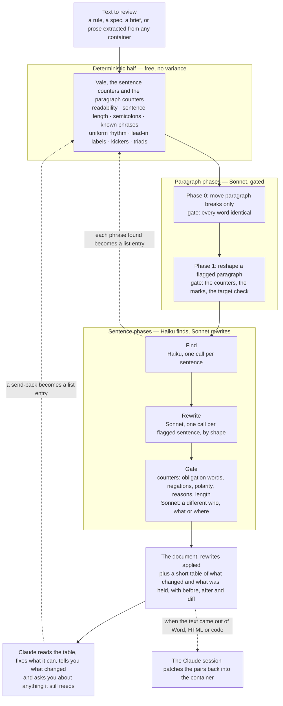

# Claudian Translator

Claudian Translator converts Claude prose to text intended for humans.

"Claudian" is prose written for the conversation that produced it. It reads fluently to the people who were there and stops everyone else: a coined phrase used as if it had been defined, a metaphor that carries the meaning, a reason folded into a rule, three obligations welded into one sentence, bullets rendered horizontally, an abstraction doing a person's job. A page of it has a shape too. Paragraphs all the same length, each opening with a bold label and closing on a short punchline, read as machine-made before a word is read.

The translator works at both levels. It reshapes the paragraphs, then finds the sentences and rewrites each one for a reader who was not in the room. Every rewrite passes a gate that refuses the marks of invention. Claude reads the result, fixes what it can, and tells you what changed. Its scope is text. Any container the text lives in is the job of the Claude session that runs it.

## What this does

Nobody marks the sentences. The translator finds them. It found plenty in this page: `docs/index.html` shows this README as written and as translated by its own tool, with a switch between the two and every changed passage marked (GitHub Pages serves it when enabled; the translated text and the table are in `docs/` either way). Below is one run of `node cli.mjs translate tests/before.md`: each sentence as it was written, and what came back. Another run will word the rewrites differently. The shapes and the outcomes hold.

| shape | before | after |
|---|---|---|
| metaphor as definition | A copy you did not write is still only evidence of its moment — re-derive before relying. | A copy you did not write reflects only the state of the source when it was copied. Re-derive it before relying on it. |
| metaphor as instruction | A reason that keeps recurring is a backlog item wearing a footnote's clothes. | A reason that keeps recurring should be tracked as a backlog item, not written as a footnote. |
| metaphor as rule | The census is a burn-down, not an amnesty. | The census tracks how many backlog items remain, but it does not excuse or forgive the items still on it. |
| reason inside the rule | The chain counts as a site because it is the tell — the defect this rule exists to find. | The chain is counted as a site.<br><br>*Moved out for the author to place as a note: the chain is the defect this rule exists to find.* |
| an abstraction in a person's role | Standards, specs and agent briefs written inside a long AI-assisted conversation come out readable only to that conversation. | Standards, specs and agent briefs written inside a long AI-assisted conversation come out readable only to the people who were in that conversation. |
| bullets rendered horizontally | Two lanes and one loop. The linter counts and remembers. The models read and discover. The reviewer decides. | Two lanes, one loop: the linter counts and remembers, the models read and discover, and the reviewer decides. |
| run-on sentence: 57 words, one condition, three obligations | If an attribute's legal next value depends on its current value and it meets the threshold below, it is a state machine: it belongs to a named machine definition from the first migration in which it qualifies, and a nested or parallel lifecycle is expressed in the definition, never as a loop or branch in an executor. | **Proposed, held for a person.** If an attribute's legal next value depends on its current value and it meets the threshold below, it is a state machine.<br><br>It must belong to a named machine definition, starting from the first migration in which it qualifies.<br><br>Any nested or parallel lifecycle must be expressed in that definition, not written as loop or branch logic in the code that runs it.<br><br>*Held: the split added a "must" the original did not have. Accept it or change one word.* |
| coined noun | The forcing function is the machine census. | **Kept, with a question.** *The author must supply what "the machine census" is: a script, a CI job, a tool. The paragraph never says.* |

Three outcomes, then. A rewrite that passed the gate is applied. A rewrite that shows a mark of invention is proposed and held. A sentence the translator cannot rewrite without knowledge only the author has is kept, with the question that would unlock it. The translator never blocks a document and never overrides the author. Claude reads the table. It answers the kept rows itself when it knows the answer, which it usually does, since it wrote the document, and it brings you the rest.

At the paragraph level the same run on a flat page (eleven paragraphs of about a hundred words each, every one flagged) moved breaks so that eleven paragraphs became thirteen of clearly different lengths, with the words checked identical, and reshaped nine of the twelve it then flagged, dropping the bold labels and the punchlines, without introducing a single dash or semicolon. The page came out with no document-level flag.

## How to install

Give Claude the link and say **install**.

1. *"Claude, evaluate https://github.com/Fermi-Ventures/claudian-translator for security risks. If clean, install it here."*
2. Celebrate.

`INSTALL.md` is what Claude reads: a security read first, then one command. `node cli.mjs install` finds Vale or downloads its release binary for the platform, syncs the style packs, checks that `claude -p` answers, registers the `no-claudian` skill in the project, and runs a smoke test. No package manager, no admin rights. As a Claude Code plugin instead:

```
/plugin marketplace add Fermi-Ventures/claudian-translator
/plugin install claudian-translator@claudian-translator
```

By hand: `git clone` the repo, then `node cli.mjs install --into <your project>`. `node cli.mjs doctor` reports the state at any time, including whether pandoc is present for Word documents.

## How to use

- *"Claude, produce user documentation for my engineers. No Claudian."*
- *"Claude, that sounds Claudian."*
- *"Claude, produce user documentation for my engineers. Estimate token consumption to remove Claudian."*

The first runs the translator on the document Claude just wrote and hands you the finished document. The second runs it on the passage you point at, or on Claude's last answer if you point at nothing, and shows you the before and after. The third prints sentences, calls, dollars and minutes before anything is spent. In each case you get a sentence or two on what changed and, if the translator needed something only you know, a question. You never read a table unless you ask to.

### What a run does

1. **Counts.** Vale and the counters read the whole file for free: sentence length, readability, semicolons, every phrase on the team's lists, and the paragraph shapes (uniform rhythm, uniform paragraph length, lead-in labels, kickers, triads, closers, signposts).
2. **Moves paragraph breaks** if the paragraph lengths are uniform. One Sonnet call may merge two short neighbours or split a long paragraph at a sentence. Its gate is exact: every word must be identical before and after, so it cannot invent.
3. **Reshapes each flagged paragraph.** One Sonnet call per paragraph, with the counts as evidence and formatting kept. The rules forbid the cheap fix of joining sentences with a dash or a semicolon. The gate is the same as for a sentence, plus a length band and a count of every mark (links, code spans, emphasis, headings, list markers) before and after.
4. **Finds the sentences.** Haiku reads each sentence with its paragraph and flags insider prose. The counters flag form.
5. **Rewrites each flagged sentence** by shape, with Sonnet, under the writing rules in `PLAYBOOK.md`. A run of short fragments is folded into one sentence of the same length, never expanded.
6. **Gates every rewrite.** Counters refuse a rewrite that adds an obligation word, changes the number of negations, swaps a word for its opposite, keeps a reason inside the rule, or balloons. Sonnet is asked one narrow question, whether the rewrite applies to a different who, what or where, and a yes refuses.
7. **Applies what passed** and hands the rest back.

Every call goes through a pool with a requests-per-minute cap (`--rpm`, default 40), a concurrency limit (`--jobs`, default 8), three attempts with backoff, and a pause when a response looks rate-limited. The summary line reports calls, retries and pauses. `--no-structure` skips steps 2 and 3. `--by paragraph` batches steps 5 and 6 by paragraph, which halves the calls at a small cost measured in `PLAYBOOK.md`.

### What Claude works from

Three files sit next to the document. They are Claude's working material. You see the document and a short report, and you can ask for any of them.

- `<doc>.translated.md` is the document with everything that passed the gate applied.
- `<doc>.translation.md` is the story: what happened to the paragraphs, then a table of every flagged sentence with its shape, the original, the rewrite and a note. Rows marked **kept** need something the translator did not have, and the note says what. Claude supplies it when it can. Rows marked **proposed, not applied** are rewrites the gate refused, and the note names why. Claude fixes those by hand or leaves the sentence as it was. Neither is applied by the tool.
- `<doc>.translation.json` is the same as pairs, for a program or a Claude session: for each, its `level`, its `status`, `before` exactly as it sat in the file, `after`, a word-level `diff` in `[-old-]{+new+}` notation, and the note.

### When the text lives inside something else

The translator reads markdown or plain text and nothing else, on purpose. A Word document, a Google document, an HTML page, a React component, a JSON resource file, a CMS field: the Claude session running the skill is the adapter. It can see the container and the tool cannot. It extracts the prose to a text file, runs the translator, and patches each applied pair from the JSON back where its `before` came from, verbatim, keeping every mark, tag and attribute around it. The diff tells it which words kept their place, so their marks carry over, and which are new, where a mark is a decision. For Word there is a short cut: pandoc out, translate, pandoc back with the original as the style reference, then compare the marks on both sides. Measured once, a page with a link, four code spans, six italics and six bolds came back from Word with every mark intact.

`PLAYBOOK.md` has the prompts, the writing rules, the calibration procedure and the failure modes, for anyone who wants to rebuild this from parts.

## Solution workflow



Two halves, two paragraph phases between them, one loop. The deterministic half counts what can be counted and matches every phrase it has been taught. The paragraph phases fix the shape of the page under gates that cannot invent. The sentence phases read for meaning and rewrite, and the gate refuses the marks of invention. What reaches you is a finished document and a sentence or two on what changed. The table is Claude's to read. On the regression text, sixteen of twenty-one rows were done when the run ended and five carried a question, and Claude can answer most of those itself, since it wrote the text. It asks you about the rest. Every phrase a model or the human names goes back to the lists, so the free half grows and the same phrase is never paid for twice. The lists are memory, not detection. If you would rather not maintain them, the counters need no data, and the calibration files are the one store you keep.

## Analysis

### What it costs

Two models do the work: Haiku reads every sentence, Sonnet reshapes the flagged paragraphs, rewrites the flagged sentences and answers the target question on each. At a 30 percent flag rate, which is what a first draft produces, a page of 400 words costs about twelve cents, of which the paragraph phases are about two. `node cli.mjs estimate <file>` prints the exact figure for your file before you spend anything.

| document | Haiku calls (find) | Sonnet calls (paragraphs, rewrite, target check) | cost |
|---|---|---|---|
| one page, 400 words, about 27 sentences | 27 | 22 | about $0.12 |
| a ten-page document | 270 | 220 | about $1.20 |
| this README, measured with `estimate` | 108 | 104 | $0.51 |
| the same at a 10 percent flag rate, prose that has already been edited once | 108 | 62 | $0.33 |

Prices are the public list at the time of writing (Haiku $1 in and $5 out per million tokens, Sonnet $3 and $15). Edit `PRICES` at the top of `tools/translate.mjs` if yours differ. Batching by paragraph is available and is not the default: measured, Haiku stops flagging the strongest sentences when it reads them in a batch, and the saving on a small document is a few cents.

### How we know it does not invent

The first version of the converter had no gate. On the regression text it rewrote twelve sentences and three of them said more than the original, and one turned a statement of evidence into a new obligation. So the gate was built and calibrated on labelled pairs: fourteen rewrites a human reviewer had accepted, six inventions from those early runs, four inversions of the kind a safety manual cannot survive (a dropped *not*, *never* to *always*, *never return false* to *do not return true*), and six swaps of who, what or where (*children* to *adults*, *in a bathtub* to *near a bathtub*, *validator* to *parser*).

A Sonnet call asked "does the rewrite mean the same" accepted 4 of the first 12 good rewrites and let 2 of the 6 inventions through, in one framing, and 5 and 5 in another: near chance both times, so that question was dropped. Sonnet is asked one narrow question instead: does the rewrite apply to a different who, what or where than the original? On first calibration it caught every swap in the set with two false alarms. Counters decide the rest. A rewrite is refused if it adds an obligation word (*must*, *never*, *only*), changes the number of negations (a dropped *not* is how "do not operate in a bathtub" becomes "operate in a bathtub"), swaps a word for its opposite from a fixed list (*true* for *false*, *on* for *off*, *allow* for *deny*), keeps a reason inside the rule, or runs past 2.5 times the original's length. Either refusing holds the rewrite.

On 32 labelled pairs, 16 good and 16 bad, the gate refuses 13 of the 16 bad rewrites and accepts 10 of the 16 good ones. The six good rewrites it holds each introduced a *not* while saying a metaphor plainly, or named a person the target check read as a new target, and holding is the side to err on. What it missed: two rewrites that supplied a plausible definition from outside the paragraph, which no counter sees and the target question does not ask about, and one place swap the model caught on one run and missed on the next. A model answer varies between runs. A counter does not. Those are yours to catch, and the table is short enough that you can. Do not run this on text where an inverted sentence can hurt someone unless a person reads every applied row.

### What the numbers are, and are not

Thirty-two pairs and twenty-five labelled sentences are calibration sets, not samples. They exist so that every change to a prompt or a counter is run against the same pass/fail set before it ships (`node cli.mjs calibrate`, `node cli.mjs calibrate --check`), and the finder's figures on its set (Haiku precision 0.77 and recall 0.83, Sonnet 0.69 and 0.92) are read the same way: a regression line, not a claim about all prose. The paragraph counters have a first calibration of one human-written document against six machine-written ones, recorded in `tests/paragraphs.calibration.md` with the same warning. Add your own reviewer's send-backs to the calibration files and the numbers become yours.

## Layout

```
README.md                         this document
INSTALL.md                        what "install" means, written for an agent
PLAYBOOK.md                       prompts, writing rules, calibration, failure modes, what was measured
cli.mjs                           install · doctor · lint · paragraphs · translate · estimate · calibrate
.claude-plugin/                   plugin and marketplace manifests
skills/no-claudian/               the skill behind "No Claudian", including the container steps
tools/translate.mjs               phases 0 and 1, find → rewrite → gate → apply, --estimate, --calibrate-check, --calibrate-find
tools/paragraphs.mjs              the paragraph counters, as a tool and a module
tools/claudian.mjs                the finder alone (and --calibrate)
tools/plain-reader.mjs            the two-reader diff and the strict probe
tools/hygiene-sweep.mjs           the sentence counters; zero-dependency fallback
vale/.vale.ini                    the Vale configuration (markdown, MDX, HTML, plain text)
vale/styles/Team/                 Semicolon · Justification · Insider · InsiderWord · AITells · Personified
vale/styles/Slopster/             vendored generic AI-tells style (MIT; see PROVENANCE.md)
tests/before.md                   the regression text: the before column, in prose, plus three controls
tests/fidelity.calibration.json   labelled rewrite pairs: the gate's regression test
tests/claudian.calibration.json   labelled sentences: the finder's regression test
tests/paragraphs.calibration.md   the paragraph counters' first calibration
tests/insider.literal-controls.md literal uses that the lists must not flag
```
