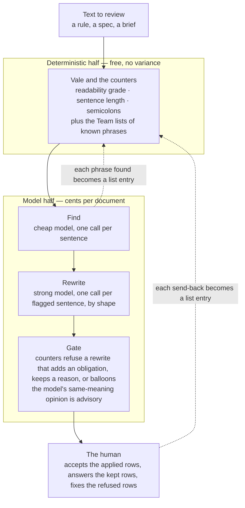

# Claudian Translator

Claudian Translator converts Claude prose to text intended for humans.

"Claudian" is prose written for the conversation that produced it. It reads fluently to the people who were there and stops everyone else: a coined phrase used as if it had been defined, a metaphor that carries the meaning, a reason folded into a rule, three obligations welded into one sentence, bullets rendered horizontally, an abstraction doing a person's job. The translator finds those sentences, rewrites each one for a reader who was not in the room, refuses any rewrite that shows the marks of invention, and hands the result back for a human to accept.

## What this does

Every "before" below was sent back by a human reviewer or flagged by the translator. Every "after" is the text that replaced it.

| shape | before | after |
|---|---|---|
| metaphor as definition | A copy you did not write is still only evidence of its moment — re-derive before relying. | A copied fact in a document you did not write was true when it was copied, not necessarily now. Check the source before you act on it. |
| metaphor as instruction | A reason that keeps recurring is a backlog item wearing a footnote's clothes. | File a recurring reason as the backlog item it is. |
| metaphor as rule | The census is a burn-down, not an amnesty. | A census is a list of debts to pay down, not a pardon. |
| coined noun | The forcing function is the machine census. | The census is what finds a state written outside the machine. |
| reason inside the rule | The chain counts as a site because it is the tell — the defect this rule exists to find. | The chain is counted as evidence of the defect, not as permission for it. |
| an abstraction in a person's role | Standards written inside a long AI-assisted conversation come out readable only to that conversation. | Standards written inside a long AI-assisted conversation come out readable only to the people who were in that conversation. |
| run-on sentence: 57 words, one condition, three obligations | If an attribute's legal next value depends on its current value and it meets the threshold below, it is a state machine: it belongs to a named machine definition from the first migration in which it qualifies, and a nested or parallel lifecycle is expressed in the definition, never as a loop or branch in an executor. | An attribute is a state machine when its legal next value depends on its current value and it meets the threshold below. Nothing else is required.<br><br>A state machine belongs to a named machine definition, from the first change in which it qualifies.<br><br>Where a lifecycle nests or runs in parallel, it is expressed in the definition, never as a loop or branch in an executor. |
| bullets rendered horizontally | Two lanes and one loop. The linter counts and remembers. The models read and discover. The reviewer decides. | Two lanes, one loop: the linter counts sentences, the models read for meaning, and the reviewer decides. |

## How to install

Give Claude the link and say **install**.

1. *"Claude, evaluate https://github.com/Fermi-Ventures/claudian-translator for security risks. If clean, install it here."*
2. Celebrate.

`INSTALL.md` is what Claude reads: a security read first, then one command. `node cli.mjs install` finds Vale or downloads its release binary for the platform, syncs the style packs, checks that `claude -p` answers, registers the `no-claudian` skill in the project, and runs a smoke test. No package manager, no admin rights. As a Claude Code plugin instead:

```
/plugin marketplace add Fermi-Ventures/claudian-translator
/plugin install claudian-translator@claudian-translator
```

By hand: `git clone` the repo, then `node cli.mjs install --into <your project>`. `node cli.mjs doctor` reports the state at any time.

## How to use

- *"Claude, produce user documentation for my engineers. No Claudian."*
- *"Claude, produce user documentation for my engineers. Estimate token consumption to remove Claudian."*

The skill runs `cli.mjs translate` on the document. You get two files back: `<doc>.translation.md`, a table of every flagged sentence with its shape, the original, the rewrite and a note, and `<doc>.translated.md`, the document with the rewrites that passed the gate applied. Sentences marked **kept** need something only the author knows, and the note says what. Sentences marked **proposed, not applied** are rewrites the gate refused: a new obligation word, a reason left inside the rule, or a rewrite far longer than the original, which is what invention looks like. They are never applied without a person.

By hand:

```sh
node cli.mjs translate doc.md              # find (cheap model), rewrite (strong model), gate (counters), apply
node cli.mjs estimate doc.md --rate 0.3    # no model calls: sentences, tokens, dollars, minutes
node cli.mjs lint doc.md                   # the free Vale lint on its own
```

`PLAYBOOK.md` has the prompts, the writing rules, the calibration procedure and the failure modes, for anyone who wants to rebuild this from parts.

## Analysis

**What it was measured on.** Rule text: two engineering standards drafted by AI agents and returned by a human reviewer five times in 48 hours. On the shortest returned standard the lane found ten defects between the returned text and the current one, and all ten are resolved: four of form, two ambiguities a busy reader resolves the wrong way, two insider phrases or reasons placed inside a rule, one candidate contradiction, and one clause that failed to reach its reader. The counters found the four form defects for nothing, and two of those four had passed every model reader. The model steps found the six defects of meaning for about eight cents an iteration. Two of the reviewer's five send-backs that week were caught by no instrument. The human stays last.

**The finder.** On 25 labelled sentences (the reviewer's send-backs and the sentences they accepted), the cheap model runs at precision 0.77 and recall 0.83, the strong one at 0.69 and 0.92. A known phrase slips about one run in six unless a list remembers it, which is what the Team lists are for.

**The gate.** The converter's first run on the regression text (`tests/before.md`: the before column above in prose, plus three controls) flagged 17 of 24 sentences, rewrote 12 and kept 5 with a named reason. Three of the twelve rewrites said more than the original, and one turned a statement of evidence into a new obligation. A strong-model check asked "does the rewrite mean the same" was calibrated on 18 labelled pairs (12 rewrites the reviewer accepted, 6 inventions) in two framings and scored 4 of 12 and 2 of 6, near chance, so its verdict is printed as advice and never decides. Three counters decide instead: a rewrite that adds an obligation word, keeps a reason inside the rule, or runs past 2.5 times the original's length is refused and shown as a proposal. On the same 18 pairs the counters accept 11 of the 12 and refuse 4 of the 6. The two inventions with no countable tell are the reader's to catch, and the table exists so they can.

**The result.** With the gate, and with a run of fragments merged into one unit so it can be folded rather than expanded, the regression text gives 21 units, 12 flagged, 7 applied, 2 refused and 3 kept. The two refusals are an invention at 3.4 times the original's length and a split that added a *must*. The three kept are the two sentences whose meaning only the author holds and the literal control. The folded hook came back as one sentence of the original's length.

**Cost for 100 pages.** About 40,000 words of end-user documentation, at the measured rates, with the calls run eight at a time.

| step | what it catches | model spend, 100 pages | machine time | human time |
|---|---|---|---|---|
| Vale with the Team lists | form: long sentences, semicolons, grade, every known phrase | $0 | about 2 seconds | reading flags, about 2 minutes a page |
| find (cheap model, one call a sentence) | new coined phrases and metaphors | about $1.50 | one at a time: about 70 minutes<br>eight at a time: about 10 minutes | none |
| rewrite (strong model, one call a flagged sentence) | the rewrite, by shape | about $2.50 at a 10 percent flag rate | one at a time: about 35 minutes<br>eight at a time: about 5 minutes | none |
| gate and advisory check (counters, plus one strong-model call a rewrite) | a rewrite that adds an obligation, keeps a reason, or balloons | about $1.00 | one at a time: about 25 minutes<br>eight at a time: about 3 minutes | none |
| accept | the kept and the proposed rows | $0 | none | about a minute a row. At a 10 percent flag rate, about 4.5 hours |
| **total** | | **about $5** | **one at a time: about 2 hours<br>eight at a time: about 18 minutes** | **about 8 hours of editor time** |

## Solution workflow



Two halves and one loop. The deterministic half counts what can be counted and matches every phrase it has been taught. The model half reads for meaning and rewrites. The counters then refuse any rewrite that shows the marks of invention. Every phrase a model or the human names goes back to the lists, so the free half grows and the same phrase is never paid for twice. The lists are memory, not detection. If you would rather not maintain them, the counters need no data, and the calibration file is the one store you keep. It measures the models, and it can be quoted into the finder's prompt as examples.

## Layout

```
README.md                         this document
INSTALL.md                        what "install" means, written for an agent
PLAYBOOK.md                       prompts, writing rules, calibration, failure modes
cli.mjs                           install · doctor · lint · translate · estimate · calibrate
.claude-plugin/                   plugin and marketplace manifests
skills/no-claudian/               the skill behind "No Claudian"
tools/translate.mjs               find → rewrite → gate → apply; --estimate; --calibrate-check
tools/claudian.mjs                the finder alone (and --calibrate)
tools/plain-reader.mjs            the two-reader diff and the strict probe
tools/hygiene-sweep.mjs           the counters; zero-dependency fallback
vale/.vale.ini                    the Vale configuration
vale/styles/Team/                 Semicolon · Justification · Insider · InsiderWord · AITells · Personified
vale/styles/Slopster/             vendored generic AI-tells style (MIT; see PROVENANCE.md)
tests/before.md                   the regression text: the before column, in prose, plus three controls
tests/fidelity.calibration.json   labelled rewrite pairs: the gate's regression test
tests/claudian.calibration.json   labelled sentences: the finder's regression test
tests/insider.literal-controls.md literal uses that the lists must not flag
```
